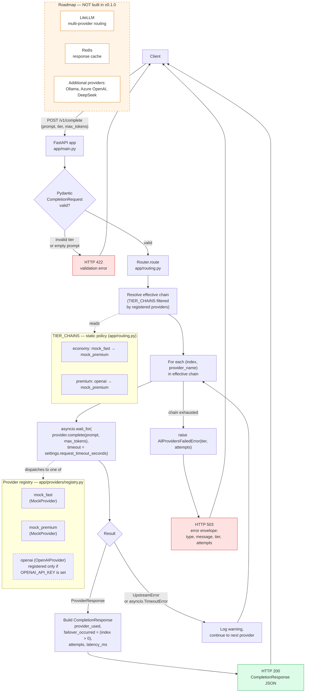

<!-- Banner prepended by sequence p6/0-scope-honesty-and-consolidation (2026-05-25) -->

> **Reference implementation — read-only.**
>
> This directory is the consolidated, frozen snapshot of the
> [`bls-ai-gateway`](https://github.com/CalmAfterReboot/bls-ai-gateway)
> working repository as of 2026-05-25, brought into BLS-DevOps via
> sequence `p6/0-scope-honesty-and-consolidation`. The upstream
> `bls-ai-gateway` repository is scheduled for archive once this
> consolidation lands.
>
> **Do not develop here.** The canonical, deployed LLM gateway
> lives at [`k8s/workloads/llm-gateway/`](../../k8s/workloads/llm-gateway/)
> and is the sole source of truth for the live chart, ADR-008,
> and the matrix ApplicationSet wiring (ADR-005).
>
> This tree is retained as a reference for the earlier
> FastAPI-with-pluggable-providers architecture (OpenAI / mock /
> registry pattern in `app/providers/`) and the live-test
> verification artefacts under `docs/verification/` (captured
> 2026-05-23). The historical README and SECURITY.md below are
> preserved verbatim from the source repo.

---

# BLS AI Gateway

A small FastAPI service that sits in front of one or more LLM providers and routes
incoming completion requests across them. The problem it solves is simple but real:
applications that depend on a single LLM endpoint inherit that endpoint's failure
modes — rate limits, timeouts, transient 5xx, regional outages — directly. The
gateway turns "talk to provider X" into "talk to tier T", and quietly fails over
between providers within a tier when the primary misbehaves, so the caller sees a
healthy response (or a single well-shaped 503) instead of a tangle of upstream
errors.

## Architecture

> The diagram below is mirrored verbatim from [`docs/architecture.mmd`](docs/architecture.mmd), which is the source of truth — edit there and copy back.



**Tier-based routing with sequential failover.** Each request carries a `tier`
(currently `economy` or `premium`). A static policy table, `TIER_CHAINS` in
[`app/routing.py`](app/routing.py), maps each tier to an ordered list of provider
names. The `Router` walks that list for every request: it gives each provider a
bounded amount of wall-clock time (`request_timeout_seconds`), and on either an
`asyncio.TimeoutError` or an `UpstreamError` it logs a warning and moves on to
the next provider. The response carries `failover_occurred`, `attempts`, and the
name of the provider that actually answered, so callers can observe failover
behaviour without parsing logs.

**Provider adapter abstraction.** Every provider implements the same tiny
`Provider` protocol in [`app/providers/base.py`](app/providers/base.py): a `name`
attribute and `async def complete(prompt, max_tokens) -> ProviderResponse`. Adding
a new backend means writing one adapter and registering it — the router doesn't
care whether it's calling a mock, OpenAI, or anything else. SDK-level exceptions
are translated into a uniform `UpstreamError` so the router can treat all
backends the same way.

**Mock-by-default, real-OpenAI-capable.** The registry always wires up two
configurable mock providers (`mock_fast`, `mock_premium`) and only registers the
real OpenAI provider if `OPENAI_API_KEY` is set. This is deliberate: it lets the
whole gateway — including tier routing and failover — be developed, demonstrated,
and tested deterministically without spending a cent or depending on network
weather. The mocks have three configurable behaviours (`success`, `error`,
`timeout`), which is enough to exercise every code path in the Router. When a
real key is present, the premium chain transparently becomes `openai →
mock_premium`; when it isn't, the chain shortens to just `mock_premium` and a
warning is logged at startup, rather than failing at request time.

## Quickstart

```bash
python -m venv .venv
source .venv/bin/activate
pip install -r requirements.txt -r requirements-dev.txt

cp .env.example .env       # optional — defaults work fine for the mock path
uvicorn app.main:app --reload
```

Then in another shell:

```bash
curl -s http://127.0.0.1:8000/health | python -m json.tool

curl -s -X POST http://127.0.0.1:8000/v1/complete \
  -H 'Content-Type: application/json' \
  -d '{"prompt":"hello gateway","tier":"economy","max_tokens":32}' \
  | python -m json.tool
```

You should get back a `CompletionResponse` with `provider_used: "mock_fast"`,
`failover_occurred: false`, `attempts: 1`.

## Project structure

```
.
├── app/
│   ├── __init__.py          # Package marker.
│   ├── main.py              # FastAPI app: lifespan, endpoints, exception handlers.
│   ├── config.py            # pydantic-settings Settings + cached get_settings().
│   ├── models.py            # Pydantic v2 models: Tier, CompletionRequest, CompletionResponse.
│   ├── errors.py            # Exception hierarchy: GatewayError, UpstreamError, AllProvidersFailedError.
│   ├── routing.py           # TIER_CHAINS policy table and Router with the failover loop.
│   └── providers/
│       ├── __init__.py      # Package marker.
│       ├── base.py          # Provider protocol and ProviderResponse dataclass.
│       ├── mock.py          # MockProvider with success / error / timeout behaviours.
│       ├── openai.py        # OpenAIProvider — AsyncOpenAI client, SDK errors → UpstreamError.
│       └── registry.py      # build_registry(settings): wires mocks + conditional openai.
├── tests/
│   ├── __init__.py          # Package marker.
│   ├── conftest.py          # make_router / make_client factory fixtures.
│   ├── test_routing.py      # Unit tests for Router.route() failover paths.
│   └── test_api.py          # Integration tests for the FastAPI endpoints via TestClient.
├── docs/
│   └── architecture.mmd     # Mermaid source of truth for the README diagram.
├── .env.example             # Documented env vars with placeholder values.
├── .gitignore               # Python, virtualenv, and .env ignores.
├── pyproject.toml           # pytest asyncio mode and ruff line-length config.
├── requirements.txt         # Runtime: fastapi, uvicorn, pydantic, pydantic-settings, openai.
├── requirements-dev.txt     # Test/lint: pytest, pytest-asyncio, httpx, ruff.
└── README.md                # This file.
```

## Failover demonstration

To see the gateway fail over from a broken primary to a healthy fallback:

```bash
# 1. Stop the running uvicorn (Ctrl+C).
# 2. Restart it with the fast mock configured to error:
MOCK_FAST_BEHAVIOR=error uvicorn app.main:app --reload

# 3. Hit the same endpoint:
curl -s -X POST http://127.0.0.1:8000/v1/complete \
  -H 'Content-Type: application/json' \
  -d '{"prompt":"hello gateway","tier":"economy"}' \
  | python -m json.tool
```

The response now reports `provider_used: "mock_premium"`, `failover_occurred:
true`, `attempts: 2`. The uvicorn logs will show a warning line for the
`mock_fast` upstream error followed by a successful response from
`mock_premium`. The caller's experience is unchanged: still HTTP 200, still a
well-formed `CompletionResponse`. To see the all-providers-failed path, also set
`MOCK_PREMIUM_BEHAVIOR=error` and observe HTTP 503 with the structured error
envelope (`{"error": {"type": "AllProvidersFailedError", "tier": "...",
"attempts": ...}}`).

## Testing

```bash
source .venv/bin/activate
pytest -v
```

The default suite (`tests/test_routing.py`, `tests/test_api.py`) covers:

- **Routing unit tests**, hitting `Router.route()` directly with synthetic mock
  registries: primary success on economy, premium tier resolution, failover on
  `UpstreamError`, failover on `asyncio.TimeoutError`, and the all-fail path
  raising `AllProvidersFailedError` with the correct `attempts` count.
- **API integration tests**, hitting the FastAPI app via `TestClient`:
  `/health`, the happy `/v1/complete` path, invalid input returning 422
  (FastAPI's default Pydantic validation), and the all-providers-fail path
  returning 503 with the structured error envelope.

The default suite is deterministic — it never makes real network calls, and
the only test that depends on wall-clock time uses a generous timeout budget
against the mock's 30s "timeout" sleep, leaving a wide margin over the mock's
success-path latency.

### Live tests (opt-in)

A second suite under `tests/live/` exercises the real OpenAI path. These tests
are gated behind the `live` pytest marker and **excluded from the default
run** via `addopts = -m 'not live'` in `pyproject.toml`. They will skip
cleanly if `OPENAI_API_KEY` is absent from `.env`/the environment, so they
never break CI.

```bash
# Run only the live suite (requires a real key in .env):
pytest -m live -v
```

Each live test writes a sanitised JSON artefact under `docs/verification/`
containing the request, the gateway response envelope, latency, and (for the
failover case) the exact forcing condition. The artefacts contain no API key,
no headers, and no auth material — only the public response shape.

Current artefacts committed to this repo:

| Scenario | Artefact | Result |
|----------|----------|--------|
| Happy path (premium tier hits OpenAI primary) | [`docs/verification/openai-live-happy-path-2026-05-23.json`](docs/verification/openai-live-happy-path-2026-05-23.json) | `provider_used: "openai"`, `attempts: 1`, `failover_occurred: false` |
| Forced failover (`OpenAIProvider._model` patched to non-existent model → 404 → `UpstreamError`) | [`docs/verification/openai-live-forced-failover-2026-05-23.json`](docs/verification/openai-live-forced-failover-2026-05-23.json) | `provider_used: "mock_premium"`, `attempts: 2`, `failover_occurred: true` |

## Roadmap / deferred

The current implementation covers the routing and failover machinery,
exercised end-to-end against both the mock providers and a real OpenAI
endpoint (see the [Live tests](#live-tests-opt-in) section above and the
committed artefacts under `docs/verification/`). The following items are
noted as the next phase and are **not implemented** here:

- **LiteLLM-backed multi-provider routing** — replace direct SDK calls with a
  LiteLLM-style abstraction so adding a new vendor is configuration, not code.
- **Redis response caching** — short-TTL cache keyed on `(provider, model,
  prompt, max_tokens)` to absorb duplicate requests and protect upstreams.
- **Additional providers** — Ollama (local), Azure OpenAI, DeepSeek, and others,
  registered alongside OpenAI and slotted into the tier chains.
- **Containerisation & deployment** — Dockerfile, a small compose stack
  (gateway + Redis), and a deployment recipe for a single VM or a managed
  container platform.
